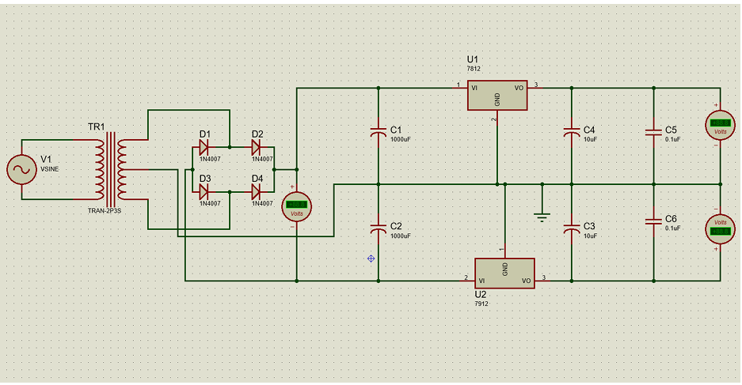

# ⚡ Dual DC Power Supply 
A **regulated dual DC power supply** designed to provide both **positive (+V)** and **negative (−V)** voltages (±5V to ±24V).  
This project was developed for the **ECE 2200 course** at **Khulna University of Engineering & Technology (KUET)**.

---

## 🧠 Project Overview

Some electronic circuits — like **Op-Amps**, **audio amplifiers**, and **analog systems** — require both **positive** and **negative** voltage rails.  
This project demonstrates how to design and implement a **dual DC power supply** using:
- A **center-tapped transformer**
- A **full-bridge rectifier**
- **Filter capacitors**
- **Voltage regulator ICs (LM78XX / LM79XX)**

---

## 🎯 Objectives

✅ Design and fabricate a dual DC power supply  
✅ Adjustable from **±5V to ±24V**  
✅ Regulated, low ripple, and lightweight  
✅ Cost-effective and suitable for lab applications  

---

## 🧩 Components Used

| Component | Quantity | Description |
|------------|-----------|-------------|
| Step-down Transformer (220V–24V CT, 1A) | 1 | Converts AC mains to 12V-0-12V |
| Diodes (1N4007) | 4 | Used in full-bridge rectifier |
| Electrolytic Capacitors | 4 | 1000µF and 10µF (for filtering) |
| Non-polar Capacitors | 2 | 0.1µF (for smoothing) |
| Voltage Regulators (LM78XX / LM79XX) | 4 | +5V, −5V, +12V, −12V, etc. |
| DC Voltmeters | 3 | For output voltage monitoring |
| Misc. Components | — | Wires, board, and connectors |

---

## 🪄 Working Principle

### ⚙️ Step 1: AC Step Down
The **center-tapped transformer** converts **220V AC** into **dual 12V AC**.

### ⚙️ Step 2: AC to DC Conversion
A **full-bridge rectifier** (4 × 1N4007 diodes) converts AC to **pulsating DC**.

### ⚙️ Step 3: Filtering
**Electrolytic capacitors** smooth out ripples to produce stable DC voltage.

### ⚙️ Step 4: Voltage Regulation
**LM78XX** provides **positive voltages**,  
**LM79XX** provides **negative voltages**.

Examples:  
- LM7805 → +5V  LM7905 → −5V  
- LM7824 → +24V  LM7924 → −24V  

---

## 🔌 Circuit Diagram

  
*Fig: Circuit diagram of the dual DC power supply*

---

## 📊 Data Analysis

| Regulator IC | Minimum Input (V) | Output (V) |
|---------------|--------------------|-------------|
| 7805 | 13.2 | 5 |
| 7809 | 21.8 | 9 |
| 7812 | 29.0 | 12 |
| 7815 | 34.0 | 15 |
| 7818 | 40.0 | 18 |
| 7824 | 51.8 | 24 |

---

## 💡 Results & Discussion

- The designed supply successfully produced **stable dual DC outputs** from ±5V to ±24V.  
- Small output fluctuations occurred due to **instrumental and measurement errors**.  
- The system used **low-cost and easily available components**, making it ideal for **educational projects** and **lab use**.

---

## 🧾 Conclusion

This project demonstrates a **low-cost, regulated, and adjustable dual DC power supply** that delivers both **positive and negative voltages** required by analog and amplifier circuits.  
It worked efficiently and provided a deeper understanding of **rectification**, **filtering**, and **voltage regulation** in practical electronics.

---

## 👨‍💻 Team Members

| Name | Roll | Batch |
|------|------|-------|
| Diganta Majumder | 1809057 | 2K18 |
| Saleem Abedin Fahim | 1809058 | 2K18 |
| Shahin Hossain | 1809059 | 2K18 |
| Md. Eftekhar Ahmed | 1809060 | 2K18 |
| **Bishaw Kirti Chakma** | **1809061** | **2K18** |
| Golam Rabbani Hridoy | 1709038 | — |

**Supervisors:**  
Dipayan Biswas & Nazifa Tabassum  
_Assistant Professors, Department of ECE, KUET_

---

## 📚 References

- *Electronic Devices & Circuits* — Jacob Millman, Satyabrata Jit (2nd Edition)  
- [Circuit Digest](https://circuitdigest.com/)  
- [Circuits Pedia](https://circuitspedia.com/)  
- [Wikipedia](https://en.wikipedia.org/wiki/DC_power_supply)

